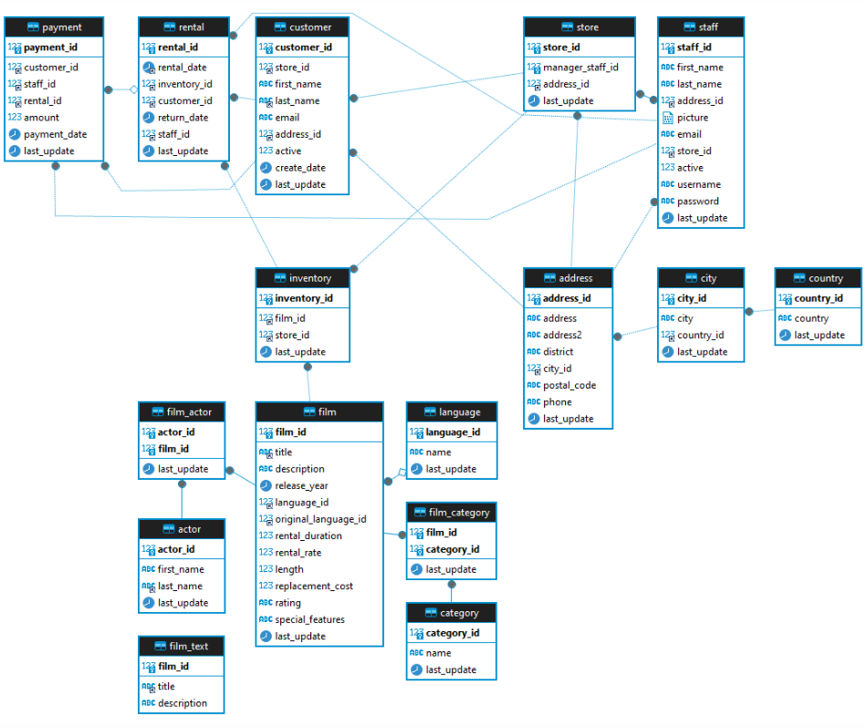

# SQL Practice

В этом разделе собраны практические задания по SQL, выполненные в данном онлайн тренажёре https://sqltest.online/

---

## ER-диаграмма



*Диаграмма отображает структуру базы данных, включая таблицы и связи между ними.*

---

## Задачи и решения

*Здесь представлены некоторые выполненные задания*

### Задача 1: Выберите название, стоимость проката и продолжительность фильмов из таблицы film. Отсортируйте полученный список по убыванию стоимости, фильмы с одинаковой стоимостью отсортируйте по возрастанию продолжительности фильма.  
```sql
SElect title, rental_rate, length FROM film 
GROUP BY film_id 
ORDER BY rental_rate DESC, length ASC;
```
### Задача 2: Выберите фамилии, имена и адреса электронной почты клиентов, чьи имя и фамилия не содержат ни одной буквы «А» (латинская буква). Отсортируйте результат по customer_id.  
```sql
SELECT last_name, first_name, email FROM customer 
WHERE first_name NOT LIKE "%A%" AND last_name NOT LIKE "%A%" 
ORDER BY customer_id ASC;
```
### Задача 3:   Найдите всех сотрудников, занятых на проекте "Video Database". Напишите запрос, который выводит номер сотрудника, имя, фамилию, дату приёма на работу и код должности. Отсортируйте результат по фамилиям в алфавитном порядке. Если фамилии совпадают, отсортируйте по коду должности.
```sql
SELECT E.EMP_NO, E.FIRST_NAME, E.LAST_NAME, E.HIRE_DATE, E.JOB_CODE FROM EMPLOYEE E
JOIN EMPLOYEE_PROJECT EP ON E.EMP_NO = EP.EMP_NO
JOIN PROJECT P ON EP.PROJ_ID = P.PROJ_ID
WHERE P.PROJ_NAME = 'Video Database'
ORDER BY E.LAST_NAME ASC, E.JOB_CODE ASC;
```
### Задача 4: Получите все фильмы в следующих категориях: Comedy, Music и Travel. Выведите таблицу со столбцами film_id, title и category, отсортированными по film_id. Напишите запрос без использования ключевого слова OR в условии.  
```sql
SELECT f.film_id, f.title, c.name AS category FROM film f
JOIN film_category fc ON f.film_id = fc.film_id
JOIN category c ON fc.category_id = c.category_id
WHERE name IN ("Comedy","Music","Travel")
ORDER BY f.film_id ASC;
```
### Задача 5: Найдите все фильмы взятые в прокат KATIE ELLIOTT. Выведите результат в два столбца title и rating. Отсортируйте список так что бы сначала шли фильмы "для взрослых" (с рейтингом R), а затем все остальные по алфавиту.  
```sql
SELECT f.title, f.rating FROM film f 
JOIN inventory i ON f.film_id = i.film_id
JOIN rental r ON i.inventory_id = r.inventory_id
JOIN customer c ON r.customer_id = c.customer_id
WHERE c.first_name LIKE "KATIE" AND c.last_name LIKE "ELLIOTT"
ORDER BY f.rating = 'R' ASC, f.title ASC;
```
### Задача 6: Сформируйте список фильмов в формате JSON вида {"id": 1, "title": "ACADEMY DINOSAUR", "category": "Documentary"} в таблице с одним столбцом film отсортированным по идентификатору фильма.  
```sql
SELECT
    JSON_OBJECT (
    'id', f.film_id,
    'title', f.title,
    'category', c.name) AS film
FROM film f    
JOIN film_category fc ON f.film_id = fc.film_id
JOIN category c ON fc.category_id = c.category_id
GROUP BY f.film_id, c.name
ORDER BY f.film_id;
```
### Задача 7: Составьте общий список адресов электронной почты клиентов и персонала. Выведите таблицу со следующими столбцами: record_type – customer или employee, last_name, first_name, email — персональные данные. Отсортируйте таблицу по фамилии и затем по имени.  
```sql
SELECT 'customer' AS record_type, last_name, first_name, email FROM customer
UNION ALL
SELECT 'employee' AS record_type, last_name, first_name, email FROM staff
ORDER BY last_name, first_name;
```
### Задача 8: Составьте месячный счет для выставления заказчику по имени DOROTHY TAYLOR за прокат фильмов в августе 2005 года. Счет должен представлять собой таблицу со следующими столбцами: title – названия взятых напрокат фильмов. rental_date, return_date, payment_date — соответствующие даты, rental_rate - стоимость проката фильма, lateness_penalty - разница между ставкой аренды и уплаченной суммой; amount - оплаченная сумма. Отсортируйте таблицу по дате платежей. Добавьте в счет сводную строку с Total в столбце title, nulls значениями во всех столбцах данных и суммами в других столбцах.  
```sql
SELECT f.title, r.rental_date, r.return_date, p.payment_date, f.rental_rate, p.amount - f.rental_rate AS lateness_penalty, p.amount FROM customer c
JOIN rental r ON c.customer_id = r.customer_id
JOIN payment p ON r.rental_id = p.rental_id
JOIN inventory i ON r.inventory_id = i.inventory_id
JOIN film f ON i.film_id = f.film_id
WHERE c.first_name = 'DOROTHY' AND c.last_name = 'TAYLOR' AND MONTH(r.rental_date) = 8 AND YEAR(r.rental_date) = 2005

UNION ALL

SELECT 'Total', NULL, NULL, NULL, sum(f.rental_rate), sum(p.amount - f.rental_rate) AS lateness_penalty, sum(p.amount) FROM customer c
JOIN rental r ON c.customer_id = r.customer_id
JOIN payment p ON r.rental_id = p.rental_id
JOIN inventory i ON r.inventory_id = i.inventory_id
JOIN film f ON i.film_id = f.film_id
WHERE c.first_name = 'DOROTHY' AND c.last_name = 'TAYLOR' AND MONTH(r.rental_date) = 8 AND YEAR(r.rental_date) = 2005;

```
### Задача 9: Представьте, что цена в столбце rental_rate таблицы film включает налог НДС в размере 18%. Напишите запрос для получения суммы налога, цены до налога и полной цены аренды фильмов. Выведите таблицу результатов со следующими столбцами: film_id, title, rental_rate_before_tax, tax и rental_rate, отсортировав её по столбцу film_id.  
```sql
SELECT 
    f.film_id, 
    f.title, 
    ROUND(f.rental_rate / 1.18, 2) AS rental_rate_before_tax, 
    ROUND(f.rental_rate - f.rental_rate / 1.18, 2) AS tax, 
    f.rental_rate 
FROM film f
```

